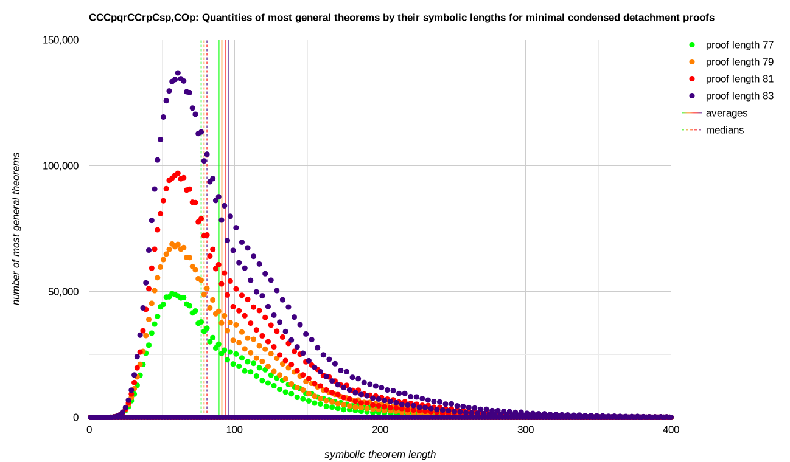

# [`CCCpqrCCrpCsp,COp`](https://github.com/xamidi/pmData/tree/master/sys/CCCpqrCCrpCsp,COp)

<sup>The shortest single axiom for classical implicational logic, together with the principle of explosion. They axiomatizatize classical propositional logic in terms of {→,⊥}.</sup>

- Hash: `d099134db97a750df3c662fb6ffa88c2d84bc409e4109a48410d25f9` [i.e. [SHA512/224](https://emn178.github.io/online-tools/sha512_224.html?input=CCC0.1.2CC2.0C3.0CO0&input_type=utf-8&output_type=hex)("`CCC0.1.2CC2.0C3.0CO0`")]
- System: `CCCpqrCCrpCsp,COp` [i.e. `1`:[`((p→q)→r)→((r→p)→(s→p))`](https://xamidi.github.io/logic-structuralizer/), `2`:[`⊥→p`](https://xamidi.github.io/logic-structuralizer/)]
- Demonstration: [xamidi/pmGenerator#13](https://github.com/xamidi/pmGenerator/discussions/13#discussioncomment-17370222)

<details open><summary>Fingerprint <picture></picture> &nbsp;<sup><sub>[<a href="https://xamidi.github.io/pmData/sys/CCCpqrCCrpCsp,COp/bgraph_grayscale.svg">grayscale</a>] [<a href="https://xamidi.github.io/pmData/sys/CCCpqrCCrpCsp,COp/plot_data_x400.txt">raw</a>]</sub></sup></summary>
<a href="https://xamidi.github.io/pmData/sys/CCCpqrCCrpCsp,COp/bgraph.svg"></a></details>
<details open markdown="1"><summary>Data <picture></picture></summary>

|                                                                                           Files up to..                                                                                           | &nbsp; Size of Files   <br>[B]         &nbsp; |                                              +Costs&nbsp;&nbsp;<br>[≈core&#x2011;h]                |                                                                Recent&nbsp;<br>Growth                                                                |
| ------------------------------------------------------------------------------------------------------------------------------------------------------------------------------------------------- | ---------------------------------------------:| --------------------------------------------------------------------------------------------------:| ----------------------------------------------------------------------------------------------------------------------------------------------------:|
| <sup><sub>[dProofs81.txt](https://e.pcloud.link/publink/show?code=XZFXNrZPBHxON6CxJk1dxtDR9AkojHl2dDV "2'531'886'162 bytes compressed into 95'376'306 bytes (ratio approx. 26.5463)")</sub></sup> |                                 2 531 886 162 | [17310.40](https://xamidi.github.io/pmData/sys/CCCpqrCCrpCsp,COp/log/dProofs81_60node_5760cpu.log) |  [1.4742…](https://www.wolframalpha.com/input?i=810545237%2F549805926 "size(dProofs81.txt) / size(dProofs79.txt)")                                   |
| <sup><sub>[dProofs83.txt](https://e.pcloud.link/publink/show?code=XZzXNrZFiIl1JqDPO02JYgYyoXdVkiPzK6V "1'187'918'763 bytes compressed into 42'242'103 bytes (ratio approx. 28.1217)")</sub></sup> |                                 3 719 804 925 | [35792.00](https://xamidi.github.io/pmData/sys/CCCpqrCCrpCsp,COp/log/dProofs83_60node_5760cpu.log) |  [1.4655…](https://www.wolframalpha.com/input?i=1187918763%2F810545237 "size(dProofs83.txt) / size(dProofs81.txt)")                                  |
| <sup><sub>dProofs85&#x2011;unfiltered85+.txt</sub></sup>                                                                                                                                          |                                20 719 453 444 |   [112.69](log/dProofs85-93-unfiltered85+_64cpu.log#L127-L183)                                     | [14.3104…](https://www.wolframalpha.com/input?i=16999648519%2F1187918763 "size(dProofs85-unfiltered85+.txt) / size(dProofs83.txt)")                  |
| <sup><sub>dProofs87&#x2011;unfiltered85+.txt</sub></sup>                                                                                                                                          |                                64 772 912 668 |   [213.68](log/dProofs85-93-unfiltered85+_64cpu.log#L185-L241)                                     |  [2.5914…](https://www.wolframalpha.com/input?i=44053459224%2F16999648519 "size(dProofs87-unfiltered85+.txt) / size(dProofs85-unfiltered85+.txt)")   |
| <sup><sub>dProofs89&#x2011;unfiltered85+.txt</sub></sup>                                                                                                                                          |                               163 246 801 423 |   [434.06](log/dProofs85-93-unfiltered85+_64cpu.log#L243-L299)                                     |  [2.2353…](https://www.wolframalpha.com/input?i=98473888755%2F44053459224 "size(dProofs89-unfiltered85+.txt) / size(dProofs87-unfiltered85+.txt)")   |
| <sup><sub>dProofs91&#x2011;unfiltered85+.txt</sub></sup>                                                                                                                                          |                               341 553 471 625 |   [881.99](log/dProofs85-93-unfiltered85+_64cpu.log#L301-L357)                                     |  [1.8106…](https://www.wolframalpha.com/input?i=178306670202%2F98473888755 "size(dProofs91-unfiltered85+.txt) / size(dProofs89-unfiltered85+.txt)")  |
| <sup><sub>dProofs93&#x2011;unfiltered85+.txt</sub></sup>                                                                                                                                          |                               691 422 259 426 |  [1815.61](log/dProofs85-93-unfiltered85+_64cpu.log#L359-L415)                                     |  [1.9621…](https://www.wolframalpha.com/input?i=349868787801%2F178306670202 "size(dProofs93-unfiltered85+.txt) / size(dProofs91-unfiltered85+.txt)") |

- Smallest 10k theorems (with minimal proofs): [top10000SmallestConclusions_1to93Steps.txt](https://xamidi.github.io/pmData/sys/CCCpqrCCrpCsp,COp/excerpt/top10000SmallestConclusions_1to93Steps.txt) (1.622864 MB)
  - Includes all up-to-17-symbol theorems that can be generated in up to 93 steps.

</details>
<details markdown="1"><summary>Cardinalities <picture></picture></summary>

```
         2 dProofs1.txt
         1 dProofs3.txt
         1 dProofs5.txt
         3 dProofs7.txt
         8 dProofs9.txt
        15 dProofs11.txt
        22 dProofs13.txt
        33 dProofs15.txt
        45 dProofs17.txt
        69 dProofs19.txt
       101 dProofs21.txt
       140 dProofs23.txt
       205 dProofs25.txt
       280 dProofs27.txt
       404 dProofs29.txt
       568 dProofs31.txt
       809 dProofs33.txt
      1140 dProofs35.txt
      1614 dProofs37.txt
      2278 dProofs39.txt
      3217 dProofs41.txt
      4529 dProofs43.txt
      6426 dProofs45.txt
      9042 dProofs47.txt
     12829 dProofs49.txt
     18076 dProofs51.txt
     25667 dProofs53.txt
     36224 dProofs55.txt
     51530 dProofs57.txt
     72889 dProofs59.txt
    103901 dProofs61.txt
    147416 dProofs63.txt
    210360 dProofs65.txt
    299183 dProofs67.txt
    427694 dProofs69.txt
    609264 dProofs71.txt
    872065 dProofs73.txt
   1244628 dProofs75.txt
   1782980 dProofs77.txt
   2547752 dProofs79.txt
   3653261 dProofs81.txt
   5226411 dProofs83.txt
  74024284 dProofs85-unfiltered85+.txt
 185049299 dProofs87-unfiltered85+.txt
 364350012 dProofs89-unfiltered85+.txt
 633578953 dProofs91-unfiltered85+.txt
1146953429 dProofs93-unfiltered85+.txt
```

</details>

### Extracted & Partially Generated

- [(`--extract -l 50`)-dProofs1-93-unfiltered85+](https://e.pcloud.link/publink/show?code=XZvYfcZNxUl8i3tz94Vq7D1uUoXrH5Y1ifV "15'272'355'812 bytes compressed into 769'383'161 bytes (ratio approx. 19.8501)") (Folder: `extraction-l50`)
- [(`--extract -l 40`)-dProofs1-93-(`-g -l 40`)-111-(`-g -l 30`)-141](https://e.pcloud.link/publink/show?code=XZiYfcZCjGjez4mEqBXsjna6Q84hH13awfy "2'199'867'870 bytes compressed into 105'846'255 bytes (ratio approx. 20.7836)") (Folder: `extraction-l40l30`)
  - Up to `dProofs93.txt` were created via `-m` from `-l 40`-extractions of exhaustive files, thus are complete w.r.t. `-l 40` entries.
  - Smallest 42679 theorems (with proofs): [l40l30-top42679SmallestConclusions_1to141Steps.txt](https://xamidi.github.io/pmData/sys/CCCpqrCCrpCsp,COp/excerpt/l40l30-top42679SmallestConclusions_1to141Steps.txt) (7.851301 MB)
    - Includes all generated up-to-19-symbol theorems. All proofs with up to 95 steps are minimal.
  - Smallest 124246 theorems (with proofs): [l40l30-top124246SmallestConclusions_1to141Steps.txt](https://xamidi.github.io/pmData/sys/CCCpqrCCrpCsp,COp/excerpt/l40l30-top124246SmallestConclusions_1to141Steps.txt) (24.082907 MB)
    - Includes all generated up-to-21-symbol theorems. All proofs with up to 95 steps are minimal.
- [(`--extract -l 40`)-dProofs1-41-(`-e l40l30 --extract -l 21`)-141-(`-g -l 21`)-159](https://e.pcloud.link/publink/show?code=XZrYfcZgdbPpjqJx9pGudWwmvIDQm1onQuy "24'400'772 bytes compressed into 1'374'725 bytes (ratio approx. 17.7496)") (Folder: `extraction-l21`)
  - Exemplary search:
    ```sh
    pmGenerator -c -n -s CCCpqrCCrpCsp,COp -e l21 --search Cpp,CpCqp,CCpCqrCCpqCpr,CCCpOOp,CCCpqOp,CCpqCCqrCpr,CCCpOpp,CCCpqpp,CpCCpOq,CCCpOCqOCqp,CCCpqCrOCrp -n -s
    ```

### Exemplary Proofs

##### Concrete D-proofs / “Proof List”

```
% Identity principle (Cpp), i.e. 0→0 ; 13 steps
DDDD1D11D1112,
% Axiom 1 by Frege (CpCqp), i.e. 0→(1→0) ; 15 steps
DDD11DDD1D11111,
% Axiom 2 by Frege (CCpCqrCCpqCpr), i.e. (0→(1→2))→((0→1)→(0→2)) ; 239 steps
DDDD1D1D1DDDDDD1D1D1D1DDDD1D1D111111111DDDDD1D1D1D1DDDD1D1D11111111111DDD1DDDDDD1D1D1D1DDDD1D1D1111111111D1DDDDDD1D1D1D1DDDD1D1D111111111DDDD1D1D1D1DDD1DDDD1DDD1D1D1D1D1DDDD1D1D111111111DDD1DDD1DDD1D1D1DDDD1D1D1111111D1D1DDD1D1111111111111,
% Double negation elimination (CCCpOOp [C-N: CNNpp]), i.e. ((0→⊥)→⊥)→0 [C-N: ¬¬0→0], instance of:
% CCCpqOp, i.e. ((0→1)→⊥)→0 ; 31 steps
DDDD1DDD1D1DDDD1D1D11111D111112,
% Axiom 1 by Łukasiewicz (CCpqCCqrCpr), i.e. (0→1)→((1→2)→(0→2)) ; 101 steps
DDDD1D1D1D1DDD1DDDD1DDD1D1D1D1D1DDDD1D1D111111111DDD1DDD1DDD1D1D1DDDD1D1D1111111D1D1DDD1D111111111111,
% Axiom 2 by Łukasiewicz (CCCpOpp [C-N: CCNppp]), i.e. ((0→⊥)→0)→0 [C-N: (¬0→0)→0], instance of:
% Peirce's law (CCCpqpp), i.e. ((p→q)→p)→p ; 31 steps
DDD1DDD1D1DDD1D111111DDD1D11111,
% Axiom 3 by Łukasiewicz (CpCCpOq [C-N: CpCNpq]), i.e. 0→((0→⊥)→1) [C-N: 0→(¬0→1)] ; 111 steps
DDDD1DDD1D1DDDD1D1D11111DDDD1D1D1DDDDDD1D1D1D1DDDD1D1D111111111111D1DDDDDD1DDD1D1D1D1D1DDDD1D1D1111111111121112,
% Axiom 3 for Frege by Łukasiewicz (CCCpOCqOCqp [C-N: CCNpNqCqp]), i.e. ((0→⊥)→(1→⊥))→(1→0) [C-N: (¬0→¬1)→(1→0)], instance of:
% CCCpqCrOCrp, i.e. ((0→1)→(2→⊥))→(2→0) ; 155 steps
DDD1DDDDDD1D1D1D1DDDD1D1D1111111111DDDDDD1D1D1D1DDDD1D1D111111111DDDD1DDDD1DDD1D1D1D1D1DDDD1D1D111111111DDD1DDD1DDD1D1D1DDDD1D1D1111111D1D1DDD1D11111111121
```

- Exemplary parse:
  ```sh
  pmGenerator -c -n -s CCCpqrCCrpCsp,COp --parse proofList.txt -f -u -j 1
  pmGenerator -c -n -s CCCpqrCCrpCsp,COp --parse DDDD1D11D1112,DDD11DDD1D11111,DDDD1D1D1DDDDDD1D1D1D1DDDD1D1D111111111DDDDD1D1D1D1DDDD1D1D11111111111DDD1DDDDDD1D1D1D1DDDD1D1D1111111111D1DDDDDD1D1D1D1DDDD1D1D111111111DDDD1D1D1D1DDD1DDDD1DDD1D1D1D1D1DDDD1D1D111111111DDD1DDD1DDD1D1D1DDDD1D1D1111111D1D1DDD1D1111111111111,DDDD1DDD1D1DDDD1D1D11111D111112,DDDD1D1D1D1DDD1DDDD1DDD1D1D1D1D1DDDD1D1D111111111DDD1DDD1DDD1D1D1DDDD1D1D1111111D1D1DDD1D111111111111,DDD1DDD1D1DDD1D111111DDD1D11111,DDDD1DDD1D1DDDD1D1D11111DDDD1D1D1DDDDDD1D1D1D1DDDD1D1D111111111111D1DDDDDD1DDD1D1D1D1D1DDDD1D1D1111111111121112,DDD1DDDDDD1D1D1D1DDDD1D1D1111111111DDDDDD1D1D1D1DDDD1D1D111111111DDDD1DDDD1DDD1D1D1D1D1DDDD1D1D111111111DDD1DDD1DDD1D1D1DDDD1D1D1111111D1D1DDD1D11111111121 -u -j 1
  ```

##### Abstract Representation / “Proof Summary”

```
    CCCpqrCCrpCsp = 1
    COp = 2
[0] Cpp = DDDD1D11D1112
[1] CpCqp = DDD11DDD1D11111
[2] CCCpqCCCrCqstCutCvCCCrCqstCut = D1D1DDDD1D1D11111
[3] CCpCqrCCCpsrCqr = DDDDD1D1[2]1111
[4] CCCpqpp = DDD1DDD1D1DDD1D111111DDD1D11111
[5] CCCpqOp = DDDD1DD[2]D111112
[6] CCpCqCrsCCrpCqCrs = DDD1DDDD1DDD1D1D1[2]1111DDD1DDD1DDD1[2]11D1D1DDD1D111111111
[7] CCpqCCqrCpr = DDDD1D1D1D1[6]111
[8] CpCCpOq = DDDD1DD[2]DDDD1D1D1D[3]111D1DDDDDD1DDD1D1D1[2]11111121112
[9] CCCpqCrOCrp = DDD1D[3]1D[3]D[6]21
[10] CCpCqrCCpqCpr = DDDD1D1D1D[3][3]11DDD1D[3]1D1D[3][7]1
```
- Exemplary transform:
  ```sh
  pmGenerator --transform proofSummary.txt -f -n -t Cpp,CpCqp,CCCpqpp,CCCpqOp,CCpqCCqrCpr,CpCCpOq,CCCpqCrOCrp,CCpCqrCCpqCpr -p -2 -d
  pmGenerator --transform "CCCpqrCCrpCsp=1,COp=2,[0]=DDDD1D11D1112,[1]=DDD11DDD1D11111,[2]=D1D1DDDD1D1D11111,[3]=DDDDD1D1[2]1111,[4]=DDD1DDD1D1DDD1D111111DDD1D11111,[5]=DDDD1DD[2]D111112,[6]=DDD1DDDD1DDD1D1D1[2]1111DDD1DDD1DDD1[2]11D1D1DDD1D111111111,[7]=DDDD1D1D1D1[6]111,[8]=DDDD1DD[2]DDDD1D1D1D[3]111D1DDDDDD1DDD1D1D1[2]11111121112,[9]=DDD1D[3]1D[3]D[6]21,[10]=DDDD1D1D1D[3][3]11DDD1D[3]1D1D[3][7]1" -n -w -t Cpp,CpCqp,CCCpqpp,CCCpqOp,CCpqCCqrCpr,CpCCpOq,CCCpqCrOCrp,CCpCqrCCpqCpr -p -2 -d
  ```

## Comparison: [`CCCpqrCCrpCsp`](https://github.com/xamidi/pmData/tree/master/sys/CCCpqrCCrpCsp) vs. [`CCCpqrCCrpCsp,COp`](https://github.com/xamidi/pmData/tree/master/sys/CCCpqrCCrpCsp,COp)

<sup>**#₁**⬚ means number of ⬚ w.r.t. `CCCpqrCCrpCsp`; **#₂**⬚ means number of ⬚ w.r.t. `CCCpqrCCrpCsp,COp`. **F** stands for derived **f**ormulas.</sup>

<details markdown="1"><summary><em><strong><sub><sup>Full table: Σ<sub>filtered</sub></sup></sub></strong></em> <picture></picture></summary>

|                              |      #₁F   &nbsp;       |      #₂F   &nbsp;       |      ΔF   &nbsp;       |      #₁`C`   &nbsp;      |      #₂`C`   &nbsp;      |      #₁`1`   &nbsp;      |      #₂`1`   &nbsp;      |     #₂`2` &nbsp;      |      #₂`O` &nbsp;      |
| ---------------------------- | -----------------------:| -----------------------:| ----------------------:| ------------------------:| ------------------------:| ------------------------:| ------------------------:| ---------------------:| ----------------------:|
| <sub>dProofs1.txt     </sub> | <sub>         1  </sub> | <sub>         2  </sub> | <sub>       +1  </sub> | <sub>          6  </sub> | <sub>          7  </sub> | <sub>          1  </sub> | <sub>          1  </sub> | <sub>       1  </sub> | <sub>        1  </sub> |
| <sub>dProofs3.txt     </sub> | <sub>         1  </sub> | <sub>         1  </sub> | <sub>        0  </sub> | <sub>          8  </sub> | <sub>          8  </sub> | <sub>          2  </sub> | <sub>          2  </sub> | <sub>       0  </sub> | <sub>        0  </sub> |
| <sub>dProofs5.txt     </sub> | <sub>         1  </sub> | <sub>         1  </sub> | <sub>        0  </sub> | <sub>         11  </sub> | <sub>         11  </sub> | <sub>          3  </sub> | <sub>          3  </sub> | <sub>       0  </sub> | <sub>        0  </sub> |
| <sub>dProofs7.txt     </sub> | <sub>         3  </sub> | <sub>         3  </sub> | <sub>        0  </sub> | <sub>         21  </sub> | <sub>         21  </sub> | <sub>         12  </sub> | <sub>         12  </sub> | <sub>       0  </sub> | <sub>        0  </sub> |
| <sub>dProofs9.txt     </sub> | <sub>         8  </sub> | <sub>         8  </sub> | <sub>        0  </sub> | <sub>         53  </sub> | <sub>         53  </sub> | <sub>         40  </sub> | <sub>         40  </sub> | <sub>       0  </sub> | <sub>        0  </sub> |
| <sub>dProofs11.txt    </sub> | <sub>        14  </sub> | <sub>        15  </sub> | <sub>       +1  </sub> | <sub>        113  </sub> | <sub>        115  </sub> | <sub>         84  </sub> | <sub>         89  </sub> | <sub>       1  </sub> | <sub>        1  </sub> |
| <sub>dProofs13.txt    </sub> | <sub>        21  </sub> | <sub>        22  </sub> | <sub>       +1  </sub> | <sub>        181  </sub> | <sub>        180  </sub> | <sub>        147  </sub> | <sub>        152  </sub> | <sub>       2  </sub> | <sub>        1  </sub> |
| <sub>dProofs15.txt    </sub> | <sub>        31  </sub> | <sub>        33  </sub> | <sub>       +2  </sub> | <sub>        312  </sub> | <sub>        325  </sub> | <sub>        248  </sub> | <sub>        261  </sub> | <sub>       3  </sub> | <sub>        6  </sub> |
| <sub>dProofs17.txt    </sub> | <sub>        42  </sub> | <sub>        45  </sub> | <sub>       +3  </sub> | <sub>        477  </sub> | <sub>        496  </sub> | <sub>        378  </sub> | <sub>        401  </sub> | <sub>       4  </sub> | <sub>        7  </sub> |
| <sub>dProofs19.txt    </sub> | <sub>        65  </sub> | <sub>        69  </sub> | <sub>       +4  </sub> | <sub>        779  </sub> | <sub>        801  </sub> | <sub>        650  </sub> | <sub>        686  </sub> | <sub>       4  </sub> | <sub>        4  </sub> |
| <sub>dProofs21.txt    </sub> | <sub>        98  </sub> | <sub>       101  </sub> | <sub>       +3  </sub> | <sub>       1238  </sub> | <sub>       1273  </sub> | <sub>       1078  </sub> | <sub>       1107  </sub> | <sub>       4  </sub> | <sub>        7  </sub> |
| <sub>dProofs23.txt    </sub> | <sub>       135  </sub> | <sub>       140  </sub> | <sub>       +5  </sub> | <sub>       1955  </sub> | <sub>       1997  </sub> | <sub>       1620  </sub> | <sub>       1675  </sub> | <sub>       5  </sub> | <sub>        6  </sub> |
| <sub>dProofs25.txt    </sub> | <sub>       197  </sub> | <sub>       205  </sub> | <sub>       +8  </sub> | <sub>       3093  </sub> | <sub>       3182  </sub> | <sub>       2561  </sub> | <sub>       2657  </sub> | <sub>       8  </sub> | <sub>       15  </sub> |
| <sub>dProofs27.txt    </sub> | <sub>       270  </sub> | <sub>       280  </sub> | <sub>      +10  </sub> | <sub>       4603  </sub> | <sub>       4700  </sub> | <sub>       3780  </sub> | <sub>       3910  </sub> | <sub>      10  </sub> | <sub>       12  </sub> |
| <sub>dProofs29.txt    </sub> | <sub>       388  </sub> | <sub>       404  </sub> | <sub>      +16  </sub> | <sub>       7017  </sub> | <sub>       7231  </sub> | <sub>       5820  </sub> | <sub>       6044  </sub> | <sub>      16  </sub> | <sub>       30  </sub> |
| <sub>dProofs31.txt    </sub> | <sub>       551  </sub> | <sub>       568  </sub> | <sub>      +17  </sub> | <sub>      10583  </sub> | <sub>      10774  </sub> | <sub>       8816  </sub> | <sub>       9071  </sub> | <sub>      17  </sub> | <sub>       21  </sub> |
| <sub>dProofs33.txt    </sub> | <sub>       783  </sub> | <sub>       809  </sub> | <sub>      +26  </sub> | <sub>      15887  </sub> | <sub>      16287  </sub> | <sub>      13311  </sub> | <sub>      13727  </sub> | <sub>      26  </sub> | <sub>       47  </sub> |
| <sub>dProofs35.txt    </sub> | <sub>      1106  </sub> | <sub>      1140  </sub> | <sub>      +34  </sub> | <sub>      23769  </sub> | <sub>      24224  </sub> | <sub>      19908  </sub> | <sub>      20486  </sub> | <sub>      34  </sub> | <sub>       44  </sub> |
| <sub>dProofs37.txt    </sub> | <sub>      1563  </sub> | <sub>      1614  </sub> | <sub>      +51  </sub> | <sub>      35434  </sub> | <sub>      36347  </sub> | <sub>      29697  </sub> | <sub>      30615  </sub> | <sub>      51  </sub> | <sub>       96  </sub> |
| <sub>dProofs39.txt    </sub> | <sub>      2211  </sub> | <sub>      2278  </sub> | <sub>      +67  </sub> | <sub>      52527  </sub> | <sub>      53534  </sub> | <sub>      44220  </sub> | <sub>      45493  </sub> | <sub>      67  </sub> | <sub>       91  </sub> |
| <sub>dProofs41.txt    </sub> | <sub>      3116  </sub> | <sub>      3217  </sub> | <sub>     +101  </sub> | <sub>      77476  </sub> | <sub>      79459  </sub> | <sub>      65436  </sub> | <sub>      67456  </sub> | <sub>     101  </sub> | <sub>      182  </sub> |
| <sub>dProofs43.txt    </sub> | <sub>      4400  </sub> | <sub>      4529  </sub> | <sub>     +129  </sub> | <sub>     114271  </sub> | <sub>     116514  </sub> | <sub>      96800  </sub> | <sub>      99509  </sub> | <sub>     129  </sub> | <sub>      182  </sub> |
| <sub>dProofs45.txt    </sub> | <sub>      6223  </sub> | <sub>      6426  </sub> | <sub>     +203  </sub> | <sub>     168650  </sub> | <sub>     173034  </sub> | <sub>     143129  </sub> | <sub>     147595  </sub> | <sub>     203  </sub> | <sub>      373  </sub> |
| <sub>dProofs47.txt    </sub> | <sub>      8774  </sub> | <sub>      9042  </sub> | <sub>     +268  </sub> | <sub>     247206  </sub> | <sub>     252211  </sub> | <sub>     210576  </sub> | <sub>     216740  </sub> | <sub>     268  </sub> | <sub>      395  </sub> |
| <sub>dProofs49.txt    </sub> | <sub>     12413  </sub> | <sub>     12829  </sub> | <sub>     +416  </sub> | <sub>     363522  </sub> | <sub>     373063  </sub> | <sub>     310325  </sub> | <sub>     320307  </sub> | <sub>     418  </sub> | <sub>      755  </sub> |
| <sub>dProofs51.txt    </sub> | <sub>     17529  </sub> | <sub>     18076  </sub> | <sub>     +547  </sub> | <sub>     531630  </sub> | <sub>     542814  </sub> | <sub>     455754  </sub> | <sub>     469425  </sub> | <sub>     551  </sub> | <sub>      832  </sub> |
| <sub>dProofs53.txt    </sub> | <sub>     24829  </sub> | <sub>     25667  </sub> | <sub>     +838  </sub> | <sub>     780867  </sub> | <sub>     801565  </sub> | <sub>     670383  </sub> | <sub>     692168  </sub> | <sub>     841  </sub> | <sub>     1541  </sub> |
| <sub>dProofs55.txt    </sub> | <sub>     35088  </sub> | <sub>     36224  </sub> | <sub>    +1136  </sub> | <sub>    1140459  </sub> | <sub>    1165544  </sub> | <sub>     982464  </sub> | <sub>    1013125  </sub> | <sub>    1147  </sub> | <sub>     1799  </sub> |
| <sub>dProofs57.txt    </sub> | <sub>     49805  </sub> | <sub>     51530  </sub> | <sub>    +1725  </sub> | <sub>    1675162  </sub> | <sub>    1720351  </sub> | <sub>    1444345  </sub> | <sub>    1492620  </sub> | <sub>    1750  </sub> | <sub>     3170  </sub> |
| <sub>dProofs59.txt    </sub> | <sub>     70539  </sub> | <sub>     72889  </sub> | <sub>    +2350  </sub> | <sub>    2446527  </sub> | <sub>    2502666  </sub> | <sub>    2116170  </sub> | <sub>    2184280  </sub> | <sub>    2390  </sub> | <sub>     3875  </sub> |
| <sub>dProofs61.txt    </sub> | <sub>    100323  </sub> | <sub>    103901  </sub> | <sub>    +3578  </sub> | <sub>    3591891  </sub> | <sub>    3691405  </sub> | <sub>    3110013  </sub> | <sub>    3217291  </sub> | <sub>    3640  </sub> | <sub>     6745  </sub> |
| <sub>dProofs63.txt    </sub> | <sub>    142420  </sub> | <sub>    147416  </sub> | <sub>    +4996  </sub> | <sub>    5248186  </sub> | <sub>    5375375  </sub> | <sub>    4557440  </sub> | <sub>    4712210  </sub> | <sub>    5102  </sub> | <sub>     8451  </sub> |
| <sub>dProofs65.txt    </sub> | <sub>    202794  </sub> | <sub>    210360  </sub> | <sub>    +7566  </sub> | <sub>    7702008  </sub> | <sub>    7922611  </sub> | <sub>    6692202  </sub> | <sub>    6934161  </sub> | <sub>    7719  </sub> | <sub>    14296  </sub> |
| <sub>dProofs67.txt    </sub> | <sub>    288534  </sub> | <sub>    299183  </sub> | <sub>   +10649  </sub> | <sub>   11261412  </sub> | <sub>   11550346  </sub> | <sub>    9810156  </sub> | <sub>   10161303  </sub> | <sub>   10919  </sub> | <sub>    18539  </sub> |
| <sub>dProofs69.txt    </sub> | <sub>    411654  </sub> | <sub>    427694  </sub> | <sub>   +16040  </sub> | <sub>   16532019  </sub> | <sub>   17022511  </sub> | <sub>   14407890  </sub> | <sub>   14952832  </sub> | <sub>   16458  </sub> | <sub>    30653  </sub> |
| <sub>dProofs71.txt    </sub> | <sub>    586547  </sub> | <sub>    609264  </sub> | <sub>   +22717  </sub> | <sub>   24176669  </sub> | <sub>   24831016  </sub> | <sub>   21115692  </sub> | <sub>   21910141  </sub> | <sub>   23363  </sub> | <sub>    40414  </sub> |
| <sub>dProofs73.txt    </sub> | <sub>    837981  </sub> | <sub>    872065  </sub> | <sub>   +34084  </sub> | <sub>   35489102  </sub> | <sub>   36581821  </sub> | <sub>   31005297  </sub> | <sub>   32231334  </sub> | <sub>   35071  </sub> | <sub>    65634  </sub> |
| <sub>dProofs75.txt    </sub> | <sub>   1196203  </sub> | <sub>   1244628  </sub> | <sub>   +48425  </sub> | <sub>   51931319  </sub> | <sub>   53412391  </sub> | <sub>   45455714  </sub> | <sub>   47245936  </sub> | <sub>   49928  </sub> | <sub>    87827  </sub> |
| <sub>dProofs77.txt    </sub> | <sub>   1710627  </sub> | <sub>   1782980  </sub> | <sub>   +72353  </sub> | <sub>   76223828  </sub> | <sub>   78657948  </sub> | <sub>   66714453  </sub> | <sub>   69461548  </sub> | <sub>   74672  </sub> | <sub>   140625  </sub> |
| <sub>dProofs79.txt    </sub> | <sub>   2444582  </sub> | <sub>   2547752  </sub> | <sub>  +103170  </sub> | <sub>  111570583  </sub> | <sub>  114916243  </sub> | <sub>   97783280  </sub> | <sub>  101803368  </sub> | <sub>  106712  </sub> | <sub>   190526  </sub> |
| <sub>dProofs81.txt    </sub> | <sub>   3499861  </sub> | <sub>   3653261  </sub> | <sub>  +153400  </sub> | <sub>  163784713  </sub> | <sub>  169205301  </sub> | <sub>  143494301  </sub> | <sub>  149624880  </sub> | <sub>  158821  </sub> | <sub>   301027  </sub> |
| <sub>dProofs83.txt    </sub> | <sub>   5006994  </sub> | <sub>   5226411  </sub> | <sub>  +219417  </sub> | <sub>  239795256  </sub> | <sub>  247330300  </sub> | <sub>  210293748  </sub> | <sub>  219281640  </sub> | <sub>  227622  </sub> | <sub>   412019  </sub> |
| **Σ**<sub>**filtered**</sub> | <sub>**16668725**</sub> | <sub>**17373082**</sub> | <sub>**+704357**</sub> | <sub>**755010823**</sub> | <sub>**778386055**</sub> | <sub>**661067944**</sub> | <sub>**688376301**</sub> | <sub>**728078**</sub> | <sub>**1330249**</sub> |

</details>

|                                                   |             #₁F  &nbsp;              |             #₂F  &nbsp;              |             ΔF   &nbsp;              |             #₁`C`   &nbsp;             |             #₂`C`   &nbsp;             |             #₁`1`   &nbsp;             |             #₂`1`   &nbsp;             |            #₂`2` &nbsp;             |             #₂`O` &nbsp;            |
| ------------------------------------------------- | ------------------------------------:| ------------------------------------:| ------------------------------------:| --------------------------------------:| --------------------------------------:| --------------------------------------:| --------------------------------------:| -----------------------------------:| -----------------------------------:|
| **Σ**<sub>**filtered**</sub>                      | <sub><sup>  **16668725**</sup></sub> | <sub><sup>  **17373082**</sup></sub> | <sub><sup>   **+704357**</sup></sub> | <sub><sup>   **755010823**</sup></sub> | <sub><sup>   **778386055**</sup></sub> |   <sub><sup> **661067944**</sup></sub> |   <sub><sup> **688376301**</sup></sub> | <sub><sup>   **728078**</sup></sub> | <sub><sup>  **1330249**</sup></sub> |
| <sub><sup>dProofs85-unfiltered85+.txt</sup></sub> | <sub><sup>    68838412  </sup></sub> | <sub><sup>    74024284  </sup></sub> | <sub><sup>    +5185872  </sup></sub> | <sub><sup>    3447875490  </sup></sub> | <sub><sup>    3633993208  </sup></sub> |   <sub><sup>  2960051716  </sup></sub> |   <sub><sup>  3177386277  </sup></sub> | <sub><sup>    5657935  </sup></sub> | <sub><sup>    9847396  </sup></sub> |
| <sub><sup>dProofs87-unfiltered85+.txt</sup></sub> | <sub><sup>   170845717  </sup></sub> | <sub><sup>   185049299  </sup></sub> | <sub><sup>   +14203582  </sup></sub> | <sub><sup>    8984407350  </sup></sub> | <sub><sup>    9522321881  </sup></sub> |   <sub><sup>  7517211548  </sup></sub> |   <sub><sup>  8127221988  </sup></sub> | <sub><sup>   14947168  </sup></sub> | <sub><sup>   26349695  </sup></sub> |
| <sub><sup>dProofs89-unfiltered85+.txt</sup></sub> | <sub><sup>   335691857  </sup></sub> | <sub><sup>   364350012  </sup></sub> | <sub><sup>   +28658155  </sup></sub> | <sub><sup>   21100407016  </sup></sub> | <sub><sup>   22388393933  </sup></sub> |   <sub><sup> 15106133565  </sup></sub> |   <sub><sup> 16366042880  </sup></sub> | <sub><sup>   29707660  </sup></sub> | <sub><sup>   61263473  </sup></sub> |
| <sub><sup>dProofs91-unfiltered85+.txt</sup></sub> | <sub><sup>   584703462  </sup></sub> | <sub><sup>   633578953  </sup></sub> | <sub><sup>   +48875491  </sup></sub> | <sub><sup>   38592404748  </sup></sub> | <sub><sup>   40930919963  </sup></sub> |   <sub><sup> 26896359252  </sup></sub> |   <sub><sup> 29093971016  </sup></sub> | <sub><sup>   50660822  </sup></sub> | <sub><sup>  109999861  </sup></sub> |
| <sub><sup>dProofs93-unfiltered85+.txt</sup></sub> | <sub><sup>  1060815488  </sup></sub> | <sub><sup>  1146953429  </sup></sub> | <sub><sup>   +86137941  </sup></sub> | <sub><sup>   77867616745  </sup></sub> | <sub><sup>   82380233788  </sup></sub> |   <sub><sup> 49858327936  </sup></sub> |   <sub><sup> 53817494470  </sup></sub> | <sub><sup>   89316693  </sup></sub> | <sub><sup>  216232606  </sup></sub> |
| **Σ**<sub>**all**</sub>                           | <sub><sup>**2237563661**</sup></sub> | <sub><sup>**2421329059**</sup></sub> | <sub><sup>**+183765398**</sup></sub> | <sub><sup>**150747722172**</sup></sub> | <sub><sup>**159634248828**</sup></sub> | <sub><sup>**102999151961**</sup></sub> | <sub><sup>**111270492932**</sup></sub> | <sub><sup>**191018356**</sup></sub> | <sub><sup>**425023280**</sup></sub> |

The tables above demonstrate effects of adding `COp` (the principle of explosion) to `CCCpqrCCrpCsp`.  
For example, by **Σ**<sub>**filtered**</sub>(**ΔF**) ∕ **Σ**<sub>**filtered**</sub>(**#₁F**) ≈ [4.23%](https://www.wolframalpha.com/input?i=704357%2F16668725*100.0) and **Σ**<sub>**all**</sub>(**ΔF**) ∕ **Σ**<sub>**all**</sub>(**#₁F**) ≈ [8.21%](https://www.wolframalpha.com/input?i=183765398%2F2237563661*100.0), there are approximately 4.23% more theorems provable in up to 83 steps, but when accounting also for unfiltered files since `dProofs85-unfiltered85+.txt`, we already have 8.21% more theorems in up to 93 steps.

| Calculation | Observation |
| ----------- | ----------- |
| [0.11%](https://www.wolframalpha.com/input?i=728078%2F%28688376301%2B728078%29*100.0) ≈ **Σ**<sub>**filtered**</sub>(**#₂`2`**) ∕ (**Σ**<sub>**filtered**</sub>(**#₂`1`**)+**Σ**<sub>**filtered**</sub>(**#₂`2`**))<br>[0.17%](https://www.wolframalpha.com/input?i=1330249%2F%28778386055%2B1330249%29*100.0) ≈ **Σ**<sub>**filtered**</sub>(**#₂`O`**) ∕ (**Σ**<sub>**filtered**</sub>(**#₂`C`**)+**Σ**<sub>**filtered**</sub>(**#₂`O`**))<br>[0.17%](https://www.wolframalpha.com/input?i=191018356%2F%28111270492932%2B191018356%29*100.0) ≈ **Σ**<sub>**all**</sub>(**#₂`2`**) ∕ (**Σ**<sub>**all**</sub>(**#₂`1`**)+**Σ**<sub>**all**</sub>(**#₂`2`**))<br>[0.27%](https://www.wolframalpha.com/input?i=425023280%2F%28159634248828%2B425023280%29*100.0) ≈ **Σ**<sub>**all**</sub>(**#₂`O`**) ∕ (**Σ**<sub>**all**</sub>(**#₂`C`**)+**Σ**<sub>**all**</sub>(**#₂`O`**)) | In minimal proofs of up to 83 steps, only around 0.11% of used axioms are instances of `COp`, while around 0.17% of the operators of their theorems are `⊥`. The proportions go up to 0.17% and 0.27%, respectively, when also including proofs from unfiltered files of up to 93 steps. |
| [45.295](https://www.wolframalpha.com/input?i=755010823%2F16668725.0) ≈ **Σ**<sub>**filtered**</sub>(**#₁`C`**) ∕ **Σ**<sub>**filtered**</sub>(**#₁F**)<br>[44.804](https://www.wolframalpha.com/input?i=778386055%2F17373082.0) ≈ **Σ**<sub>**filtered**</sub>(**#₂`C`**) ∕ **Σ**<sub>**filtered**</sub>(**#₂F**)<br>[0.0766](https://www.wolframalpha.com/input?i=1330249%2F17373082.0) ≈ **Σ**<sub>**filtered**</sub>(**#₂`O`**) ∕ **Σ**<sub>**filtered**</sub>(**#₂F**) | Without `COp`, a theorem minimally proven by up to 83 steps has roughly 45.295 `→` operators on average. With `COp`, such a theorem has roughly 44.804 `→` and 0.0766 `⊥` operators (together ≈44.881) on average. |
| [39.659](https://www.wolframalpha.com/input?i=661067944%2F16668725.0) ≈ **Σ**<sub>**filtered**</sub>(**#₁`1`**) ∕ **Σ**<sub>**filtered**</sub>(**#₁F**)<br>[39.623](https://www.wolframalpha.com/input?i=688376301%2F17373082.0) ≈ **Σ**<sub>**filtered**</sub>(**#₂`1`**) ∕ **Σ**<sub>**filtered**</sub>(**#₂F**)<br>[0.0419](https://www.wolframalpha.com/input?i=728078%2F17373082.0) ≈ **Σ**<sub>**filtered**</sub>(**#₂`2`**) ∕ **Σ**<sub>**filtered**</sub>(**#₂F**) | On average, there are ≈39.659 axiom references per collected minimal 1-basis proof of up to 83 steps, and ≈39.665 axiom references (≈39.623×`1` and ≈0.0419×`2`) per collected 2-basis proof of up to 83 steps.<br>[**Note:** Each pure D-proof of length 2k+1 has k+1 axiom references.] |
| [134.24](https://www.wolframalpha.com/input?i=2237563661%2F16668725.0) ≈ **Σ**<sub>**all**</sub>(**#₁F**) ∕ **Σ**<sub>**filtered**</sub>(**#₁F**)<br>[199.66](https://www.wolframalpha.com/input?i=150747722172%2F755010823.0) ≈ **Σ**<sub>**all**</sub>(**#₁`C`**) ∕ **Σ**<sub>**filtered**</sub>(**#₁`C`**)<br>[155.81](https://www.wolframalpha.com/input?i=102999151961%2F661067944.0) ≈ **Σ**<sub>**all**</sub>(**#₁`1`**) ∕ **Σ**<sub>**filtered**</sub>(**#₁`1`**) | For `CCCpqrCCrpCsp`, the five files `dProofs{85,…,93}-unfiltered85+.txt` multiply the total number of theorems, `→` operators, and axiom references by approximate factors of 134.24, 199.66, and 155.81, respectively. |
| [139.37](https://www.wolframalpha.com/input?i=2421329059%2F17373082.0) ≈ **Σ**<sub>**all**</sub>(**#₂F**) ∕ **Σ**<sub>**filtered**</sub>(**#₂F**)<br>[205.08](https://www.wolframalpha.com/input?i=159634248828%2F778386055.0) ≈ **Σ**<sub>**all**</sub>(**#₂`C`**) ∕ **Σ**<sub>**filtered**</sub>(**#₂`C`**)<br>[161.64](https://www.wolframalpha.com/input?i=111270492932%2F688376301.0) ≈ **Σ**<sub>**all**</sub>(**#₂`1`**) ∕ **Σ**<sub>**filtered**</sub>(**#₂`1`**)<br>[319.51](https://www.wolframalpha.com/input?i=425023280%2F1330249.0) ≈ **Σ**<sub>**all**</sub>(**#₂`O`**) ∕ **Σ**<sub>**filtered**</sub>(**#₂`O`**)<br>[262.36](https://www.wolframalpha.com/input?i=191018356%2F728078.0) ≈ **Σ**<sub>**all**</sub>(**#₂`2`**) ∕ **Σ**<sub>**filtered**</sub>(**#₂`2`**) | In contrast to the observation above, with `COp` as a second axiom, these files multiply the total number of theorems, `→` operators, and `CCCpqrCCrpCsp`-references by approximately 139.37, 205.08, and 161.64, respectively. The approximate factors for the total number of `⊥` operators and `COp`-references are 319.51 and 262.36, respectively. |
| [5.95](https://www.wolframalpha.com/input?i=17373082%2F%2817373082-5226411-3653261-2547752-1782980-1244628%29) ≈ **Σ**<sub>**filtered**</sub>(**#₂F**) ∕ **Σ**<sub>**`dProofs{1,…,73}.txt`**</sub>(**#₂F**)<br>[6.78](https://www.wolframalpha.com/input?i=778386055%2F%28778386055-247330300-169205301-114916243-78657948-53412391%29) ≈ **Σ**<sub>**filtered**</sub>(**#₂`C`**) ∕ **Σ**<sub>**`dProofs{1,…,73}.txt`**</sub>(**#₂`C`**)<br>[6.82](https://www.wolframalpha.com/input?i=688376301%2F%28688376301-219281640-149624880-101803368-69461548-47245936%29) ≈ **Σ**<sub>**filtered**</sub>(**#₂`1`**) ∕ **Σ**<sub>**`dProofs{1,…,73}.txt`**</sub>(**#₂`1`**)<br>[6.71](https://www.wolframalpha.com/input?i=1330249%2F%281330249-412019-301027-190526-140625-87827%29) ≈ **Σ**<sub>**filtered**</sub>(**#₂`O`**) ∕ **Σ**<sub>**`dProofs{1,…,73}.txt`**</sub>(**#₂`O`**)<br>[6.60](https://www.wolframalpha.com/input?i=728078%2F%28728078-227622-158821-106712-74672-49928%29) ≈ **Σ**<sub>**filtered**</sub>(**#₂`2`**) ∕ **Σ**<sub>**`dProofs{1,…,73}.txt`**</sub>(**#₂`2`**) | To elaborate on the above, the five files `dProofs{75,…,83}.txt` multiply the total number of theorems, `→` operators, `CCCpqrCCrpCsp`-references, `⊥` operators, and `COp`-references only by approximate factors of 5.95, 6.78, 6.82, 6.71, and 6.60, respectively. That the last two are not increased compared to the two before them shows that `⊥` operators and `COp`-references are merely drastically increased in the prior case due to not being filtered out. However, since they are much rarer in total amounts (see first entry), these numbers still show their increasing proportions. |

I invite you to draw further interesting connections! Please turn it into [a comment](https://github.com/xamidi/pmGenerator/discussions/13#discussioncomment-17370222) or submit a [pull request](https://github.com/xamidi/pmData/pulls).

The data listed above is insufficient to combine multiple properties of a single entry, e.g. to determine usage distributions of primitives per proof or theorem. The following table shows how many proofs have one or multiple `2`-references, and how many `2`-referencing proofs derive `O`-free theorems. These numbers appear alongside **#₂F** and **#₂`2`** — the numbers of formulas and `2`-references (already listed above) — for easier comparison.

<details markdown="1"><summary><em><strong><sub><sup>Full table: Σ<sub>filtered</sub></sup></sub></strong></em> <picture></picture></summary>

|                              |      #₂F   &nbsp;       |     #₂`2` &nbsp;      |      #₂F[#`2`≥1]      |     #₂F[#`2`≥2]      |    #₂F[#`2`≥3]     |  #₂F[#`2`≥1,#`O`=0]  |
| ---------------------------- | -----------------------:| ---------------------:| ---------------------:| --------------------:| ------------------:| --------------------:|
| <sub>dProofs1.txt     </sub> | <sub>         2  </sub> | <sub>       1  </sub> | <sub>       1  </sub> | <sub>      0  </sub> | <sub>    0  </sub> | <sub>      0  </sub> |
| <sub>dProofs3.txt     </sub> | <sub>         1  </sub> | <sub>       0  </sub> | <sub>       0  </sub> | <sub>      0  </sub> | <sub>    0  </sub> | <sub>      0  </sub> |
| <sub>dProofs5.txt     </sub> | <sub>         1  </sub> | <sub>       0  </sub> | <sub>       0  </sub> | <sub>      0  </sub> | <sub>    0  </sub> | <sub>      0  </sub> |
| <sub>dProofs7.txt     </sub> | <sub>         3  </sub> | <sub>       0  </sub> | <sub>       0  </sub> | <sub>      0  </sub> | <sub>    0  </sub> | <sub>      0  </sub> |
| <sub>dProofs9.txt     </sub> | <sub>         8  </sub> | <sub>       0  </sub> | <sub>       0  </sub> | <sub>      0  </sub> | <sub>    0  </sub> | <sub>      0  </sub> |
| <sub>dProofs11.txt    </sub> | <sub>        15  </sub> | <sub>       1  </sub> | <sub>       1  </sub> | <sub>      0  </sub> | <sub>    0  </sub> | <sub>      0  </sub> |
| <sub>dProofs13.txt    </sub> | <sub>        22  </sub> | <sub>       2  </sub> | <sub>       2  </sub> | <sub>      0  </sub> | <sub>    0  </sub> | <sub>      1  </sub> |
| <sub>dProofs15.txt    </sub> | <sub>        33  </sub> | <sub>       3  </sub> | <sub>       3  </sub> | <sub>      0  </sub> | <sub>    0  </sub> | <sub>      0  </sub> |
| <sub>dProofs17.txt    </sub> | <sub>        45  </sub> | <sub>       4  </sub> | <sub>       4  </sub> | <sub>      0  </sub> | <sub>    0  </sub> | <sub>      0  </sub> |
| <sub>dProofs19.txt    </sub> | <sub>        69  </sub> | <sub>       4  </sub> | <sub>       4  </sub> | <sub>      0  </sub> | <sub>    0  </sub> | <sub>      0  </sub> |
| <sub>dProofs21.txt    </sub> | <sub>       101  </sub> | <sub>       4  </sub> | <sub>       4  </sub> | <sub>      0  </sub> | <sub>    0  </sub> | <sub>      0  </sub> |
| <sub>dProofs23.txt    </sub> | <sub>       140  </sub> | <sub>       5  </sub> | <sub>       5  </sub> | <sub>      0  </sub> | <sub>    0  </sub> | <sub>      0  </sub> |
| <sub>dProofs25.txt    </sub> | <sub>       205  </sub> | <sub>       8  </sub> | <sub>       8  </sub> | <sub>      0  </sub> | <sub>    0  </sub> | <sub>      0  </sub> |
| <sub>dProofs27.txt    </sub> | <sub>       280  </sub> | <sub>      10  </sub> | <sub>      10  </sub> | <sub>      0  </sub> | <sub>    0  </sub> | <sub>      0  </sub> |
| <sub>dProofs29.txt    </sub> | <sub>       404  </sub> | <sub>      16  </sub> | <sub>      16  </sub> | <sub>      0  </sub> | <sub>    0  </sub> | <sub>      0  </sub> |
| <sub>dProofs31.txt    </sub> | <sub>       568  </sub> | <sub>      17  </sub> | <sub>      17  </sub> | <sub>      0  </sub> | <sub>    0  </sub> | <sub>      0  </sub> |
| <sub>dProofs33.txt    </sub> | <sub>       809  </sub> | <sub>      26  </sub> | <sub>      26  </sub> | <sub>      0  </sub> | <sub>    0  </sub> | <sub>      0  </sub> |
| <sub>dProofs35.txt    </sub> | <sub>      1140  </sub> | <sub>      34  </sub> | <sub>      34  </sub> | <sub>      0  </sub> | <sub>    0  </sub> | <sub>      0  </sub> |
| <sub>dProofs37.txt    </sub> | <sub>      1614  </sub> | <sub>      51  </sub> | <sub>      51  </sub> | <sub>      0  </sub> | <sub>    0  </sub> | <sub>      0  </sub> |
| <sub>dProofs39.txt    </sub> | <sub>      2278  </sub> | <sub>      67  </sub> | <sub>      67  </sub> | <sub>      0  </sub> | <sub>    0  </sub> | <sub>      0  </sub> |
| <sub>dProofs41.txt    </sub> | <sub>      3217  </sub> | <sub>     101  </sub> | <sub>     101  </sub> | <sub>      0  </sub> | <sub>    0  </sub> | <sub>      0  </sub> |
| <sub>dProofs43.txt    </sub> | <sub>      4529  </sub> | <sub>     129  </sub> | <sub>     129  </sub> | <sub>      0  </sub> | <sub>    0  </sub> | <sub>      0  </sub> |
| <sub>dProofs45.txt    </sub> | <sub>      6426  </sub> | <sub>     203  </sub> | <sub>     203  </sub> | <sub>      0  </sub> | <sub>    0  </sub> | <sub>      0  </sub> |
| <sub>dProofs47.txt    </sub> | <sub>      9042  </sub> | <sub>     268  </sub> | <sub>     268  </sub> | <sub>      0  </sub> | <sub>    0  </sub> | <sub>      0  </sub> |
| <sub>dProofs49.txt    </sub> | <sub>     12829  </sub> | <sub>     418  </sub> | <sub>     416  </sub> | <sub>      2  </sub> | <sub>    0  </sub> | <sub>      0  </sub> |
| <sub>dProofs51.txt    </sub> | <sub>     18076  </sub> | <sub>     551  </sub> | <sub>     548  </sub> | <sub>      3  </sub> | <sub>    0  </sub> | <sub>      1  </sub> |
| <sub>dProofs53.txt    </sub> | <sub>     25667  </sub> | <sub>     841  </sub> | <sub>     839  </sub> | <sub>      2  </sub> | <sub>    0  </sub> | <sub>      1  </sub> |
| <sub>dProofs55.txt    </sub> | <sub>     36224  </sub> | <sub>    1147  </sub> | <sub>    1141  </sub> | <sub>      6  </sub> | <sub>    0  </sub> | <sub>      7  </sub> |
| <sub>dProofs57.txt    </sub> | <sub>     51530  </sub> | <sub>    1750  </sub> | <sub>    1739  </sub> | <sub>     11  </sub> | <sub>    0  </sub> | <sub>     14  </sub> |
| <sub>dProofs59.txt    </sub> | <sub>     72889  </sub> | <sub>    2390  </sub> | <sub>    2371  </sub> | <sub>     19  </sub> | <sub>    0  </sub> | <sub>     20  </sub> |
| <sub>dProofs61.txt    </sub> | <sub>    103901  </sub> | <sub>    3640  </sub> | <sub>    3610  </sub> | <sub>     30  </sub> | <sub>    0  </sub> | <sub>     38  </sub> |
| <sub>dProofs63.txt    </sub> | <sub>    147416  </sub> | <sub>    5102  </sub> | <sub>    5051  </sub> | <sub>     50  </sub> | <sub>    1  </sub> | <sub>     54  </sub> |
| <sub>dProofs65.txt    </sub> | <sub>    210360  </sub> | <sub>    7719  </sub> | <sub>    7644  </sub> | <sub>     74  </sub> | <sub>    1  </sub> | <sub>     83  </sub> |
| <sub>dProofs67.txt    </sub> | <sub>    299183  </sub> | <sub>   10919  </sub> | <sub>   10777  </sub> | <sub>    140  </sub> | <sub>    2  </sub> | <sub>    136  </sub> |
| <sub>dProofs69.txt    </sub> | <sub>    427694  </sub> | <sub>   16458  </sub> | <sub>   16242  </sub> | <sub>    214  </sub> | <sub>    2  </sub> | <sub>    215  </sub> |
| <sub>dProofs71.txt    </sub> | <sub>    609264  </sub> | <sub>   23363  </sub> | <sub>   23023  </sub> | <sub>    336  </sub> | <sub>    4  </sub> | <sub>    314  </sub> |
| <sub>dProofs73.txt    </sub> | <sub>    872065  </sub> | <sub>   35071  </sub> | <sub>   34539  </sub> | <sub>    526  </sub> | <sub>    6  </sub> | <sub>    482  </sub> |
| <sub>dProofs75.txt    </sub> | <sub>   1244628  </sub> | <sub>   49928  </sub> | <sub>   49129  </sub> | <sub>    788  </sub> | <sub>   11  </sub> | <sub>    736  </sub> |
| <sub>dProofs77.txt    </sub> | <sub>   1782980  </sub> | <sub>   74672  </sub> | <sub>   73416  </sub> | <sub>   1238  </sub> | <sub>   18  </sub> | <sub>   1130  </sub> |
| <sub>dProofs79.txt    </sub> | <sub>   2547752  </sub> | <sub>  106712  </sub> | <sub>  104808  </sub> | <sub>   1867  </sub> | <sub>   37  </sub> | <sub>   1725  </sub> |
| <sub>dProofs81.txt    </sub> | <sub>   3653261  </sub> | <sub>  158821  </sub> | <sub>  155869  </sub> | <sub>   2899  </sub> | <sub>   53  </sub> | <sub>   2632  </sub> |
| <sub>dProofs83.txt    </sub> | <sub>   5226411  </sub> | <sub>  227622  </sub> | <sub>  223183  </sub> | <sub>   4337  </sub> | <sub>  101  </sub> | <sub>   4023  </sub> |
| **Σ**<sub>**filtered**</sub> | <sub>**17373082**</sub> | <sub>**728078**</sub> | <sub>**715299**</sub> | <sub>**12542**</sub> | <sub>**236**</sub> | <sub>**11612**</sub> |

</details>

|                                                   |             #₂F  &nbsp;              |            #₂`2` &nbsp;             |       #₂F[#`2`≥1]        |                                                   #₂F[#`2`≥2]                                                   |                                                         #₂F[#`2`≥3]                                                          |                                              #₂F[#`2`≥1,#`O`=0]                                               |
| ------------------------------------------------- | ------------------------------------:| -----------------------------------:| ------------------------:| ---------------------------------------------------------------------------------------------------------------:| ----------------------------------------------------------------------------------------------------------------------------:| -------------------------------------------------------------------------------------------------------------:|
| **Σ**<sub>**filtered**</sub>                      | <sub><sup>  **17373082**</sup></sub> | <sub><sup>   **728078**</sup></sub> | <sub>   **715299**</sub> | <sub> [**12542**](https://xamidi.github.io/pmData/sys/CCCpqrCCrpCsp,COp/excerpt/dProofs1-83_2-2times.txt)</sub> | <sub>  **236**</sub>                                                                                                         | <sub> [**11612**](https://xamidi.github.io/pmData/sys/CCCpqrCCrpCsp,COp/excerpt/dProofs1-83_2_no-O.txt)</sub> |
| <sub><sup>dProofs85-unfiltered85+.txt</sup></sub> | <sub><sup>    74024284  </sup></sub> | <sub><sup>    5657935  </sup></sub> | <sub>    5528486  </sub> | <sub>   128054  </sub>                                                                                          | <sub>   1381  </sub>                                                                                                         | <sub>    30545  </sub>                                                                                        |
| <sub><sup>dProofs87-unfiltered85+.txt</sup></sub> | <sub><sup>   185049299  </sup></sub> | <sub><sup>   14947168  </sup></sub> | <sub>   14589508  </sub> | <sub>   353747  </sub>                                                                                          | <sub>   3877  </sub>                                                                                                         | <sub>    76422  </sub>                                                                                        |
| <sub><sup>dProofs89-unfiltered85+.txt</sup></sub> | <sub><sup>   364350012  </sup></sub> | <sub><sup>   29707660  </sup></sub> | <sub>   28980041  </sub> | <sub>   719214  </sub>                                                                                          | <sub>   8309  </sub>                                                                                                         | <sub>   375085  </sub>                                                                                        |
| <sub><sup>dProofs91-unfiltered85+.txt</sup></sub> | <sub><sup>   633578953  </sup></sub> | <sub><sup>   50660822  </sup></sub> | <sub>   49380674  </sub> | <sub>  1263772  </sub>                                                                                          | <sub>  16193  </sub>                                                                                                         | <sub>   774720  </sub>                                                                                        |
| <sub><sup>dProofs93-unfiltered85+.txt</sup></sub> | <sub><sup>  1146953429  </sup></sub> | <sub><sup>   89316693  </sup></sub> | <sub>   87112821  </sub> | <sub>  2176502  </sub>                                                                                          | <sub>  27028  </sub>                                                                                                         | <sub>  1338214  </sub>                                                                                        |
| **Σ**<sub>**all**</sub>                           | <sub><sup>**2421329059**</sup></sub> | <sub><sup>**191018356**</sup></sub> | <sub>**186306829**</sub> | <sub>**4653831**</sub>                                                                                          | <sub>[**57024**](https://xamidi.github.io/pmData/sys/CCCpqrCCrpCsp,COp/excerpt/dProofs1-93-unfiltered85+_2-3times.txt)</sub> | <sub>**2606598**</sub>                                                                                        |

I collected the entries that count towards **Σ**<sub>**filtered**</sub>(**#₂F[#`2`≥2]**), **Σ**<sub>**all**</sub>(**#₂F[#`2`≥3]**), and **Σ**<sub>**filtered**</sub>(**#₂F[#`2`≥1,#`O`=0]**). The corresponding files are linked in their respective cells. They should provide numerous use cases of the principle of explosion and thus contribute to a better understanding. Additional excerpts from `extraction-l40l30` have been uploaded [to the same location](excerpt) but are also included in the archive of the full extraction.

| Calculation | Observation |
| ----------- | ----------- |
| [1.62%](https://www.wolframalpha.com/input?i=11612%2F715299*100.0) ≈ **Σ**<sub>**filtered**</sub>(**#₂F[#`2`≥1,#`O`=0]**) ∕ **Σ**<sub>**filtered**</sub>(**#₂F[#`2`≥1]**)<br>[1.40%](https://www.wolframalpha.com/input?i=2606598%2F186306829*100.0) ≈ **Σ**<sub>**all**</sub>(**#₂F[#`2`≥1,#`O`=0]**) ∕ **Σ**<sub>**all**</sub>(**#₂F[#`2`≥1]**) | Only around 1.62% of the minimal `COp`-referencing proofs of up to 83 steps derive a `⊥`-free theorem. The proportion grows even lower when including longer unfiltered proofs. |
| [4.12%](https://www.wolframalpha.com/input?i=715299%2F17373082*100.0) ≈ **Σ**<sub>**filtered**</sub>(**#₂F[#`2`≥1]**) ∕ **Σ**<sub>**filtered**</sub>(**#₂F**)<br>[0.072%](https://www.wolframalpha.com/input?i=12542%2F17373082*100.0) ≈ **Σ**<sub>**filtered**</sub>(**#₂F[#`2`≥2]**) ∕ **Σ**<sub>**filtered**</sub>(**#₂F**)<br>[0.0014%](https://www.wolframalpha.com/input?i=236%2F17373082*100.0) ≈ **Σ**<sub>**filtered**</sub>(**#₂F[#`2`≥3]**) ∕ **Σ**<sub>**filtered**</sub>(**#₂F**)<br>[7.69%](https://www.wolframalpha.com/input?i=186306829%2F2421329059*100.0) ≈ **Σ**<sub>**all**</sub>(**#₂F[#`2`≥1]**) ∕ **Σ**<sub>**all**</sub>(**#₂F**)<br>[0.192%](https://www.wolframalpha.com/input?i=4653831%2F2421329059*100.0) ≈ **Σ**<sub>**all**</sub>(**#₂F[#`2`≥2]**) ∕ **Σ**<sub>**all**</sub>(**#₂F**)<br>[0.0024%](https://www.wolframalpha.com/input?i=57024%2F2421329059*100.0) ≈ **Σ**<sub>**all**</sub>(**#₂F[#`2`≥3]**) ∕ **Σ**<sub>**all**</sub>(**#₂F**) | Approximate proportions of minimal proofs of up to 83 steps that reference the principle of explosion at least once, twice, and thrice are 4.12%, 0.072%, and 0.0014% (less than 1 in 73614), respectively. The proportions grow to 7.69%, 0.192%, and 0.0024% (less than 1 in 42461) when also including `dProofs{85,…,93}-unfiltered85+.txt `. |
