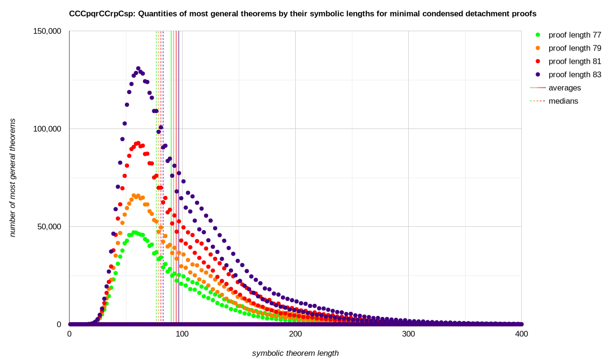

# [`CCCpqrCCrpCsp`](https://github.com/xamidi/pmData/tree/master/sys/CCCpqrCCrpCsp)

<sup>The shortest single axiom for classical implicational logic.</sup>

- Hash: `97553789db1645226627da044ed0a2e6a9cfd5963d66a8a44e121146` [i.e. [SHA512/224](https://emn178.github.io/online-tools/sha512_224.html?input=CCC0.1.2CC2.0C3.0&input_type=utf-8&output_type=hex)("`CCC0.1.2CC2.0C3.0`")]
- System: `CCCpqrCCrpCsp` [i.e. `1`:[`((p→q)→r)→((r→p)→(s→p))`](https://xamidi.github.io/logic-structuralizer/)]
- Demonstration: [xamidi/pmGenerator#13](https://github.com/xamidi/pmGenerator/discussions/13#discussioncomment-17370222)

<details open><summary>Fingerprint <picture></picture> &nbsp;<sup><sub>[<a href="https://xamidi.github.io/pmData/sys/CCCpqrCCrpCsp/bgraph_grayscale.svg">grayscale</a>] [<a href="https://xamidi.github.io/pmData/sys/CCCpqrCCrpCsp/plot_data_x400.txt">raw</a>]</sub></sup></summary>
<a href="https://xamidi.github.io/pmData/sys/CCCpqrCCrpCsp/bgraph.svg"></a></details>
<details open><summary>Data <picture></picture></summary>

|                                                                                           Files up to..                                                                                           | &nbsp; Size of Files   <br>[B]         &nbsp; |                                            +Costs&nbsp;&nbsp;<br>[≈core&#x2011;h]              |                                                                Recent&nbsp;<br>Growth                                                                |
| ------------------------------------------------------------------------------------------------------------------------------------------------------------------------------------------------- | ---------------------------------------------:| ----------------------------------------------------------------------------------------------:| ----------------------------------------------------------------------------------------------------------------------------------------------------:|
| <sup><sub>[dProofs81.txt](https://e.pcloud.link/publink/show?code=XZUkNrZElccAgg1uoQ180j6J6DnPkWkuAx7 "2'449'297'774 bytes compressed into 91'600'118 bytes (ratio approx. 26.7390)")</sub></sup> |                                 2 449 297 774 | [15529.60](https://xamidi.github.io/pmData/sys/CCCpqrCCrpCsp/log/dProofs81_60node_5760cpu.log) |  [1.4706…](https://www.wolframalpha.com/input?i=782466043%2F532052217 "size(dProofs81.txt) / size(dProofs79.txt)")                                   |
| <sup><sub>[dProofs83.txt](https://e.pcloud.link/publink/show?code=XZikNrZsgUEnHrljc0alWL7GTQ6JVQflxdk "1'147'943'959 bytes compressed into 40'530'674 bytes (ratio approx. 28.3228)")</sub></sup> |                                 3 597 241 733 | [31224.00](https://xamidi.github.io/pmData/sys/CCCpqrCCrpCsp/log/dProofs83_60node_5760cpu.log) |  [1.4670…](https://www.wolframalpha.com/input?i=1147943959%2F782466043 "size(dProofs83.txt) / size(dProofs81.txt)")                                  |
| <sup><sub>dProofs85&#x2011;unfiltered85+.txt</sub></sup>                                                                                                                                          |                                19 626 102 482 |    [69.15](log/dProofs85-93-unfiltered85+_64cpu.log#L126-L182)                                 | [13.9631…](https://www.wolframalpha.com/input?i=16028860749%2F1147943959 "size(dProofs85-unfiltered85+.txt) / size(dProofs83.txt)")                  |
| <sup><sub>dProofs87&#x2011;unfiltered85+.txt</sub></sup>                                                                                                                                          |                                60 909 402 788 |   [130.28](log/dProofs85-93-unfiltered85+_64cpu.log#L184-L240)                                 |  [2.5755…](https://www.wolframalpha.com/input?i=41283300306%2F16028860749 "size(dProofs87-unfiltered85+.txt) / size(dProofs85-unfiltered85+.txt)")   |
| <sup><sub>dProofs89&#x2011;unfiltered85+.txt</sub></sup>                                                                                                                                          |                               153 150 493 111 |   [271.16](log/dProofs85-93-unfiltered85+_64cpu.log#L242-L298)                                 |  [2.2343…](https://www.wolframalpha.com/input?i=92241090323%2F41283300306 "size(dProofs89-unfiltered85+.txt) / size(dProofs87-unfiltered85+.txt)")   |
| <sup><sub>dProofs91&#x2011;unfiltered85+.txt</sub></sup>                                                                                                                                          |                               320 324 295 368 |   [518.62](log/dProofs85-93-unfiltered85+_64cpu.log#L300-L356)                                 |  [1.8123…](https://www.wolframalpha.com/input?i=167173802257%2F92241090323 "size(dProofs91-unfiltered85+.txt) / size(dProofs89-unfiltered85+.txt)")  |
| <sup><sub>dProofs93&#x2011;unfiltered85+.txt</sub></sup>                                                                                                                                          |                               649 288 832 712 |  [1039.80](log/dProofs85-93-unfiltered85+_64cpu.log#L358-L414)                                 |  [1.9677…](https://www.wolframalpha.com/input?i=328964537344%2F167173802257 "size(dProofs93-unfiltered85+.txt) / size(dProofs91-unfiltered85+.txt)") |

- Smallest 10k theorems (with minimal proofs): [top10000SmallestConclusions_1to93Steps.txt](https://xamidi.github.io/pmData/sys/CCCpqrCCrpCsp/excerpt/top10000SmallestConclusions_1to93Steps.txt) (1.640806 MB)
  - Includes all up-to-19-symbol theorems that can be generated in up to 93 steps.

</details>
<details><summary>Cardinalities <picture></picture></summary>

```
         1 dProofs3.txt
         1 dProofs5.txt
         3 dProofs7.txt
         8 dProofs9.txt
        14 dProofs11.txt
        21 dProofs13.txt
        31 dProofs15.txt
        42 dProofs17.txt
        65 dProofs19.txt
        98 dProofs21.txt
       135 dProofs23.txt
       197 dProofs25.txt
       270 dProofs27.txt
       388 dProofs29.txt
       551 dProofs31.txt
       783 dProofs33.txt
      1106 dProofs35.txt
      1563 dProofs37.txt
      2211 dProofs39.txt
      3116 dProofs41.txt
      4400 dProofs43.txt
      6223 dProofs45.txt
      8774 dProofs47.txt
     12413 dProofs49.txt
     17529 dProofs51.txt
     24829 dProofs53.txt
     35088 dProofs55.txt
     49805 dProofs57.txt
     70539 dProofs59.txt
    100323 dProofs61.txt
    142420 dProofs63.txt
    202794 dProofs65.txt
    288534 dProofs67.txt
    411654 dProofs69.txt
    586547 dProofs71.txt
    837981 dProofs73.txt
   1196203 dProofs75.txt
   1710627 dProofs77.txt
   2444582 dProofs79.txt
   3499861 dProofs81.txt
   5006994 dProofs83.txt
  68838412 dProofs85-unfiltered85+.txt
 170845717 dProofs87-unfiltered85+.txt
 335691857 dProofs89-unfiltered85+.txt
 584703462 dProofs91-unfiltered85+.txt
1060815488 dProofs93-unfiltered85+.txt
```

</details>

### Extracted & Partially Generated

- [(`--extract -l 50`)-dProofs1-93-unfiltered91+](https://e.pcloud.link/publink/show?code=XZCYfcZGswkju1hzUzGhNj9Aj2TqYLzoi4y "7'425'650'736 bytes compressed into 371'639'556 bytes (ratio approx. 19.9808)")  (Folder: `extraction-l50`)
  - Up to `dProofs89.txt` were created via `-m` from `-l 50`-extractions of exhaustive files, thus are complete w.r.t. `-l 50` entries.
  - The remaining unfiltered files (`dProofs{91,93}-unfiltered85+.txt`) must be renamed to be loaded by *pmGenerator*.
- [(`--extract -l 40`)-dProofs1-93-(`-g -l 40`)-111-(`-g -l 30`)-153](https://e.pcloud.link/publink/show?code=XZfYfcZvInad4fcqubLrieu3sSObhxKFjoX "1'607'539'606 bytes compressed into 80'546'223 bytes (ratio approx. 19.9580)") (Folder: `extraction-l40l30`)
  - Up to `dProofs93.txt` were created via `-m` from `-l 40`-extractions of exhaustive files, thus are complete w.r.t. `-l 40` entries.
  - Smallest 24820 theorems (with proofs): [l40l30-top24820SmallestConclusions_1to153Steps.txt](https://xamidi.github.io/pmData/sys/CCCpqrCCrpCsp/excerpt/l40l30-top24820SmallestConclusions_1to153Steps.txt) (4.661867 MB)
    - Includes all generated up-to-19-symbol theorems. All proofs with up to 95 steps are minimal.
  - Smallest 76307 theorems (with proofs): [l40l30-top76307SmallestConclusions_1to153Steps.txt](https://xamidi.github.io/pmData/sys/CCCpqrCCrpCsp/excerpt/l40l30-top76307SmallestConclusions_1to153Steps.txt) (15.172891 MB)
    - Includes all generated up-to-21-symbol theorems. All proofs with up to 95 steps are minimal.
- [(`--extract -l 40`)-dProofs1-41-(`-e l40l30 --extract -l 21`)-153-(`-g -l 21`)-239](https://e.pcloud.link/publink/show?code=XZjYfcZrK8uud7EGt7PfAz6OQyNXmuf3IPV  "41'127'323 bytes compressed into 1'864'827 bytes (ratio approx. 22.0542)") (Folder: `extraction-l21`)
  - Exemplary search:
    ```sh
    pmGenerator -c -n -s CCCpqrCCrpCsp -e l21 --search Cpp,CpCqp,CCpCqrCCpqCpr,CCpqCCqrCpr,CCCpOpp,CCCpqpp -n -s
    ```

### Exemplary Proofs

##### Concrete D-proofs / “Proof List”

```
% Identity principle (Cpp), i.e. 0→0 ; 21 steps
DDDDD1D1111DDD1D11111,
% Axiom 1 by Frege (CpCqp), i.e. 0→(1→0) ; 15 steps
DDD11DDD1D11111,
% Axiom 2 by Frege (CCpCqrCCpqCpr), i.e. (0→(1→2))→((0→1)→(0→2)) ; 239 steps
DDDD1D1D1DDDDDD1D1D1D1DDDD1D1D111111111DDDDD1D1D1D1DDDD1D1D11111111111DDD1DDDDDD1D1D1D1DDDD1D1D1111111111D1DDDDDD1D1D1D1DDDD1D1D111111111DDDD1D1D1D1DDD1DDDD1DDD1D1D1D1D1DDDD1D1D111111111DDD1DDD1DDD1D1D1DDDD1D1D1111111D1D1DDD1D1111111111111,
% Axiom 1 by Łukasiewicz (CCpqCCqrCpr), i.e. (0→1)→((1→2)→(0→2)) ; 101 steps
DDDD1D1D1D1DDD1DDDD1DDD1D1D1D1D1DDDD1D1D111111111DDD1DDD1DDD1D1D1DDDD1D1D1111111D1D1DDD1D111111111111,
% Axiom 2 by Łukasiewicz (CCCpOpp [C-N: CCNppp]), i.e. ((0→⊥)→0)→0 [C-N: (¬0→0)→0], instance of:
% Peirce's law (CCCpqpp), i.e. ((p→q)→p)→p ; 31 steps
DDD1DDD1D1DDD1D111111DDD1D11111
```

- Exemplary parse:
  ```sh
  pmGenerator -c -n -s CCCpqrCCrpCsp --parse proofList.txt -f -u -j 1
  pmGenerator -c -n -s CCCpqrCCrpCsp --parse DDDDD1D1111DDD1D11111,DDD11DDD1D11111,DDDD1D1D1DDDDDD1D1D1D1DDDD1D1D111111111DDDDD1D1D1D1DDDD1D1D11111111111DDD1DDDDDD1D1D1D1DDDD1D1D1111111111D1DDDDDD1D1D1D1DDDD1D1D111111111DDDD1D1D1D1DDD1DDDD1DDD1D1D1D1D1DDDD1D1D111111111DDD1DDD1DDD1D1D1DDDD1D1D1111111D1D1DDD1D1111111111111,DDDD1D1D1D1DDD1DDDD1DDD1D1D1D1D1DDDD1D1D111111111DDD1DDD1DDD1D1D1DDDD1D1D1111111D1D1DDD1D111111111111,DDD1DDD1D1DDD1D111111DDD1D11111 -u -j 1
  ```

##### Abstract Representation / “Proof Summary”

```
    CCCpqrCCrpCsp = 1
[0] CCCpqpCrp = DDD1D1111
[1] CpCqp = DDD11[0]1
[2] Cpp = DD[0][0]1
[3] CCpCqrCCCpsrCqr = DDDDD1D1D1D1DDDD1D1D111111111
[4] CCCpqpp = DDD1DDD1D1[0]11[0]1
[5] CCpqCCqrCpr = DDDD1D1D1D1DDD1DDDD1DDD1D1D1D1D1DDDD1D1D111111111DDD1DDD1DDD1D1D1DDDD1D1D1111111D1D1[0]11111111
[6] CCpCqrCCpqCpr = DDDD1D1D1D[3][3]11DDD1D[3]1D1D[3][5]1
```
- Exemplary transform:
  ```sh
  pmGenerator --transform proofSummary.txt -f -n -t Cpp,CpCqp,CCpCqrCCpqCpr,CCpqCCqrCpr,CCCpqpp -p -2 -d
  pmGenerator --transform "CCCpqrCCrpCsp=1,[0]=DDD1D1111,[1]=DDD11[0]1,[2]=DD[0][0]1,[3]=DDDDD1D1D1D1DDDD1D1D111111111,[4]=DDD1DDD1D1[0]11[0]1,[5]=DDDD1D1D1D1DDD1DDDD1DDD1D1D1D1D1DDDD1D1D111111111DDD1DDD1DDD1D1D1DDDD1D1D1111111D1D1[0]11111111,[6]=DDDD1D1D1D[3][3]11DDD1D[3]1D1D[3][5]1" -n -w -t Cpp,CpCqp,CCpCqrCCpqCpr,CCpqCCqrCpr,CCCpqpp -p -2 -d
  ```
